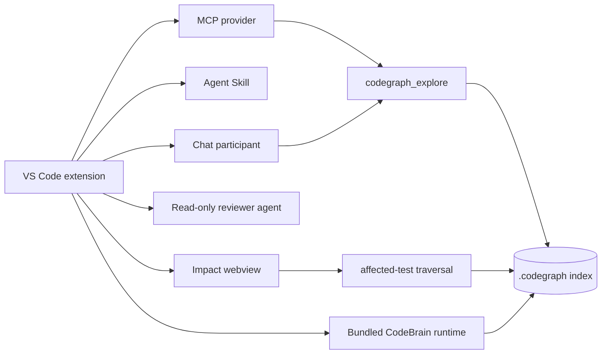

# CodeBrain for VS Code

CodeBrain for VS Code packages the semantic code engine as a self-contained, platform-specific extension. It does not require a system Node.js installation at runtime.

Vietnamese usage guide: [README-VI.md](README-VI.md).

The extension combines the runtime, AI context, and visual analysis surfaces:



- A bundled Node 24 + compiled CodeBrain runtime with a native Rust extraction kernel and safe WASM fallback.
- An automatically registered stdio MCP server exposing `codegraph_explore`.
- A contributed Agent Skill that teaches VS Code to query CodeBrain before repository-wide grep/read loops.
- A `@codebrain` chat participant with `/explain`, `/review`, and `/impact`.
- A read-only CodeBrain Reviewer custom agent.
- A change-impact workflow graph, affected-test detector, and token-saving dashboard.
- Lightweight Markdown report export with Mermaid preview.

The participant detects the dominant language of each latest user message. It
supports script-level detection (CJK, Japanese, Korean, Cyrillic, Arabic, Thai,
and Devanagari) plus vocabulary and diacritic detection for common Latin-script
languages, including Vietnamese with or without accents. Short symbol-only
requests fall back to the VS Code display language. All headings, tables, prose,
and Mermaid labels follow the detected language; code identifiers and paths keep
their original spelling.

## Features

### MCP registration

`package.json` contributes `codebrain.runtime` through `mcpServerDefinitionProviders`. On activation, the extension resolves that provider to:

```text
<extension>/runtime/<platform>-<arch>/node
  --liftoff-only
  <extension>/runtime/<platform>-<arch>/lib/dist/bin/codegraph.js
  serve --mcp
```

The MCP process always uses the runtime shipped in the VSIX. The internal `codegraph.js` executable name remains unchanged for runtime compatibility.

### Automatic index refresh

`codebrain.autoRefresh.enabled` is enabled by default. The setting controls CodeBrain's native file watcher through the MCP runtime:

- `true`: normal debounced incremental sync.
- `false`: starts the MCP server with `CODEGRAPH_NO_WATCH=1`.
- `codebrain.autoRefresh.debounceMs`: maps to `CODEGRAPH_WATCH_DEBOUNCE_MS`.

The status bar exposes Initialize, Refresh, and Status commands. Initial indexing remains an explicit one-time user action because it can be expensive on a large repository.

### Agent Skill

The extension contributes [`skills/codebrain/SKILL.md`](skills/codebrain/SKILL.md) through `contributes.chatSkills`. VS Code can load it on demand for structural questions, workflow tracing, blast-radius analysis, and code review.

It also contributes [`agents/codebrain-reviewer.agent.md`](agents/codebrain-reviewer.agent.md). This agent receives only CodeBrain tools: no edit or terminal tools. It is intended for read-only evidence gathering and conservative release-risk review.

### `@codebrain /explain`

`/explain` is designed for questions such as:

- What is this used for?
- How does this function work?
- What is the end-to-end workflow?
- Why does this component exist?

The participant:

1. Invokes the registered `codegraph_explore` MCP tool when VS Code exposes it to the participant, with a direct bundled-runtime fallback that returns the same CodeBrain output.
2. Uses the model selected in VS Code Chat to produce a structured explanation.
3. Writes the result to a temporary Markdown file.
4. Adds a Mermaid flowchart if the model omitted one.
5. Opens the built-in Markdown preview when `codebrain.reports.openPreview` is enabled.

### `@codebrain /review`

`/review` combines:

- Git status, stat, and diff.
- Active editor selection.
- CodeBrain source, callers, dependencies, and blast radius.

It returns a structured review with severity-ranked findings, an impact diagram, a regression test matrix, and an overall risk verdict. The participant is review-only; it does not modify files. Shared contracts, security, persistence, concurrency, lifecycle, and high fan-out changes are treated conservatively as high risk.

### `@codebrain /impact` and Analyze Change Impact

The command and chat route share one analysis pipeline:

1. Determine scope from tracked, staged, and untracked Git files; fall back to the active file.
2. Invoke `codegraph affected --json` with configurable dependency depth.
3. Query CodeBrain call paths and blast radius through MCP, with the bundled CLI as a local fallback.
4. Classify risk using fan-out, sensitive contracts, change width, and missing test evidence.
5. Open an interactive workflow graph. Clicking a node opens the corresponding source location.

The affected-test list is index evidence. Zero detected tests is reported as a regression gap, not as proof that no regression can occur.

### Token Saving Dashboard

The dashboard stores workspace-local aggregate estimates for:

- CodeBrain context tokens;
- a candidate-file reading baseline;
- tokens saved;
- file reads avoided;
- query latency and analysis count.

The UI and exported report explicitly label these values as estimates. They are not model billing or telemetry data, and nothing is uploaded by the metrics store.

### Markdown reports

Explain, review, and impact outputs become the latest report. Export it as lightweight Markdown that preserves headings, tables, code blocks, Unicode text, and Mermaid diagrams. Markdown can be previewed directly in VS Code, reviewed through Git diffs, or passed back to an AI agent without PDF extraction.

## Commands

- `CodeBrain: Initialize Workspace`
- `CodeBrain: Refresh Index`
- `CodeBrain: Show Index Status`
- `CodeBrain: Analyze Change Impact`
- `CodeBrain: Open Workflow Graph`
- `CodeBrain: Token Savings Dashboard`
- `CodeBrain: Export Latest Report as Markdown`

## Development

Prerequisites:

- Node.js 24.
- Rust stable to include the native kernel. Without Rust, local development builds keep the WASM fallback unless `CODEGRAPH_REQUIRE_NATIVE_KERNEL=1`.
- `bash`, `curl`, and `tar`.
- `unzip` when building a Windows runtime on Unix.

Install both projects:

```bash
cd ..
npm ci
cd vscode-extension
npm ci
```

Build the extension code only:

```bash
npm run build
```

Build and stage the runtime for the current machine:

```bash
npm run build:runtime
```

Build both:

```bash
npm run build:all
```

The runtime builder delegates to the repository's canonical `scripts/build-bundle.sh`, then extracts the resulting self-contained bundle into:

```text
runtime/<target>/
  node | node.exe
  lib/dist/
  lib/kernel/codegraph-kernel.node
  lib/node_modules/
  bin/
```

## Testing

```bash
npm test
```

This type-checks the VS Code integration and tests language detection, impact reporting, token estimates, and runtime-target handling.

A packaged-runtime smoke test can be run with:

```bash
runtime/<target>/node \
  --liftoff-only \
  --disable-warning=ExperimentalWarning \
  runtime/<target>/lib/dist/bin/codegraph.js \
  --version
```

## Packaging

Build a platform-specific VSIX for the current host:

```bash
npm run package
```

Build one explicit target:

```bash
npm run package -- --target linux-x64
```

Build all supported targets:

```bash
npm run package:all
```

Supported targets:

- `darwin-arm64`
- `darwin-x64`
- `linux-arm64`
- `linux-x64`
- `win32-arm64`
- `win32-x64`

Each VSIX contains one runtime target. This avoids shipping six complete Node + CodeBrain runtimes to every user.

## Requirements and boundaries

- VS Code `1.125.0` or newer.
- A filesystem-backed trusted workspace.
- A chat model available in VS Code for `/explain` and `/review`.
- `/impact` uses a chat model when invoked from chat; the Analyze Change Impact command, graph, affected-test detector, index operations, metrics, and exports work without one.
- The index lives inside the project as `.codegraph/` and is not uploaded by the extension.

The APIs used here follow the official VS Code guides for [MCP server providers](https://code.visualstudio.com/api/extension-guides/ai/mcp), [Chat Participants](https://code.visualstudio.com/api/extension-guides/ai/chat), and [extension-contributed Agent Skills](https://code.visualstudio.com/api/references/contribution-points#contributes.chatSkills).
